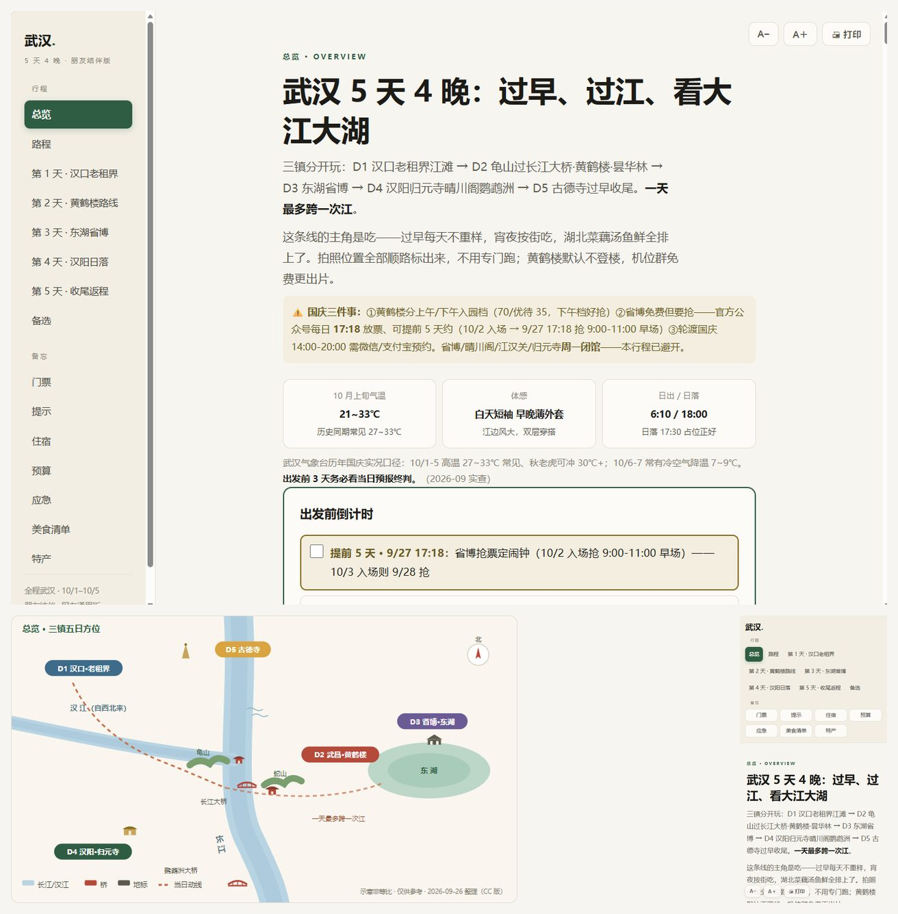
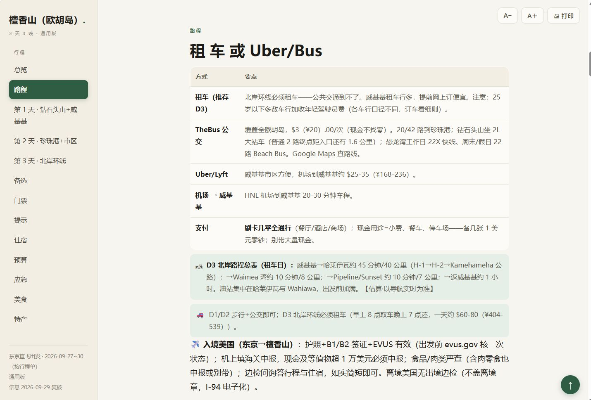


<div align="center">



# 见好 · 旅行规划器

**联网实查、可核验的出行路书工作流** —— 一句话需求，产出断网可开的单文件 HTML 路书

<sub>桌面 / 手机 / 打印三好看 · 实拍配图 + 手绘导览图 · 行程 / 路程 / 门票 / 提示 / 住宿 / 预算 / 应急 / 美食 / 特产 十大板块</sub>


<sub><a href="#这是什么">这是什么</a> · <a href="#你能得到什么">能得到什么</a> · <a href="#一份路书里有什么">路书板块</a> · <a href="#触发词">触发词</a> · <a href="#安装2-分钟">安装</a> · <a href="#版本">版本</a> · <a href="TUTORIAL.md">📖 零基础教程</a> · <a href="https://github.com/awangwang123/jianhao-travel-planner/discussions/1">📍 城市许愿池</a></sub>

</div>

---

## 这是什么

一套「出行路书」工作流：你说"想出去玩"，它按固定流程采集需求 → 联网实查 → 产出**路书**（md 事实源 + 单文件 HTML 双版本：本地完整版断网可开 + 瘦身在线版一键部署）+ **美食情报卡**（按城市持续追加的数据资产）。

> [!TIP]
> **SKILL.md 的版本史是精华**——每条规矩背后都是一次真实翻车（图注落位对 ≠ 图内容对、数指标不算对比、价钱是挂牌价不是实付价……），建议通读，比规矩本身更值钱。

## 你能得到什么

- 📄 **单文件路书**：本地完整版断网可开，手机、电脑、打印纸都好看
- 🌐 **一键部署在线版**（需自有服务器，可选）：瘦身网页版一键部署，点开链接即看
- 🔍 **信息可信**：关键信息联网实查带来源，出发前按当日预报终判
- 🖼 **每天有实拍图**：真实景点照片 + 手绘行程导览图，不堆网图
- 🍜 **吃饭有章法**：推荐店各归各位，照抄照选两相宜
- 🚫 **隐私干净**：对外内容零敏感残留
- 🍱 **美食情报卡**：按城市持续追加的数据资产，越用越厚
- ✅ **交付可验收**：内置 `tools/checklist.py` 机械检查（11 项），AI 交稿前必跑——你也能一键验收 AI 有没有偷懒

## 上线反响


<sub>开源次日的抖音介绍视频：12.6 万播放 · 2889 收藏（数据截至 2026-09-30）</sub>

## 一份路书里有什么

| 板块 | 内容 |
|------|------|
| 总览 | 一句话行程 + 天气 + 出发前倒计时（勾选式）+ 装备清单 + 总览导览图 |
| 路程 | 交通方式怎么选 + 路程总表（里程/时长）+ 支付提示 |
| 每日行程 | 半小时级时段卡 + 实拍图 + 当日导览图 + 交通/机位/雨天方案 |
| 门票预约 | 多档价格 + 预约与放票口径 |
| 温馨提示 | 真实场景 + 应对，不写正确的废话 |
| 住宿 | 选点逻辑 + 退房时间 + 订房三问 |
| 预算 | 三档概览 + 逐项明细 + 隐藏成本 |
| 应急 | 全局兜底 + 紧急电话与领事保护 |
| 美食清单 | 按天按顿给店 + 必点 + 人均 |
| 特产 | 带什么 + 在哪买 |

## 换个目的地，形态自动适配



<sub>海岛型目的地的路程板块——租车 / 公交 / 打车分层给方案，行程要素按目的地自动换挡；<b>出境版正在测试中</b>，打磨完成后发布</sub>

## 触发词

安装后，跟 AI 说这些话会自动触发本 Skill：

> 去哪玩 / 旅行攻略 / 周末去哪 / 做攻略 / 行程规划 / 自驾方案 / 当日行程 / 今天去哪 / 特产推荐

## 安装（2 分钟）

> 🐣 **完全没接触过 Claude Code？** 直接看 **[零基础跑通指南 TUTORIAL.md](TUTORIAL.md)**——从装 AI 助手到拿到第一份路书，每一步带自检。

解压后你会得到一个 `jianhao-travel-planner` 文件夹（别改名），把它整个放进 skills 目录：

- **全局**（推荐）：`~/.claude/skills/`（Windows 即 `C:\Users\<用户名>\.claude\skills\`）
- **单项目**：`<项目>\.claude\skills\`

装好后的路径应该是 `…/skills/jianhao-travel-planner/SKILL.md`。放对之后，跟 AI 说"周末想去 XX 玩"就会被自动触发。

目录结构（缺一不可）：

```
jianhao-travel-planner/
├── SKILL.md          ← 工作流正本
├── assets/           ← 路书+情报卡两份 HTML 基准骨架
└── tools/            ← consistency.py（骨架校验）+ desource.py（脱敏）
```

> ⚠️ **已有同名包？** 如果 skills 目录里已存在 `jianhao-travel-planner` 文件夹，本包拷入会覆盖它（作者的自用版叫 `travel-planner`，不同名、不受影响）。

## 配图（可选，不配也能交付）

路书要求"每天都有图"。图源任选其一：

1. **Wikimedia Commons**（默认图源，免费免 key）：按「地标名」精准检索实拍照片，挑近期真实照片用；若在你的网络环境不可达，skill 自动改用下一级图源，不影响出图
2. **Pexels**（免费可商用）：pexels.com 免费注册 → 申请 API key → 存本机 `.env`（`PEXELS_API_KEY=你的key`）或环境变量，适合氛围空镜
3. **AI 生图**：用自己的生图工具产「（示意）」图——页脚注明「AI 生成示意」即可

不配图过不了交付自查清单第⑱项；非实拍图标注「（示意）」、页脚写明来源即可。

## 第一次使用前

打开 `SKILL.md` 末尾的「用户档案（填空模板）」，复制填写你自己的偏好（出发地/口味/作息/同行者常态），填完这套 skill 就"认识"你了。信源名单不用预置——它会用大众点评+高德+小红书交叉验证，你在旅途中刷到靠谱探店内容可以补进自己的名单。

## 不需要的东西

- 任何平台登录态（抖音/小红书/B站都不需要）
- 付费 API
- 博主白名单（原个人设定已移除）

## 看完整成品

<details>
<summary><b>展开看武汉 5 天 4 晚完整路书（长图，约 2MB）</b></summary>



</details>

## 版本

- **v1.5**（2026-10-05）：新增 tools/checklist.py 机械检查+头部执行速查卡
- **v1.4**（2026-10-03）：价格纪律五条——餐饮人均口径/路程时长写线路名/估算不豁免实查/价格多处同步/收录差集核查
- **v1.3**（2026-09-30）：内容深度定标——六板块必答清单/价格含税总价制/图源三级链/总览八件
- **v1.2**（2026-09-29）：导航体验升级——侧栏滚动按序高亮、点击锁定、当日自动定位
- **v1.1**（2026-09-26）：修正打包结构与安装说明
- **v1.0**（2026-09-23）：开源首发

## 反馈与共创

- 🐛 **报错/用不了**：[Issues](https://github.com/awangwang123/jianhao-travel-planner/issues) 发帖（有模板）
- 📍 **许愿城市**：[旅行许愿池](https://github.com/awangwang123/jianhao-travel-planner/discussions/1)——点赞最高的城市，下一份官方示例就是它（附完整生成过程记录）
- 💬 其他想法：[Discussions](https://github.com/awangwang123/jianhao-travel-planner/discussions) 随便聊
